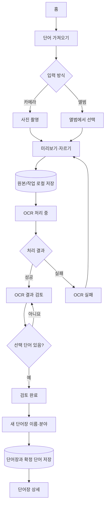
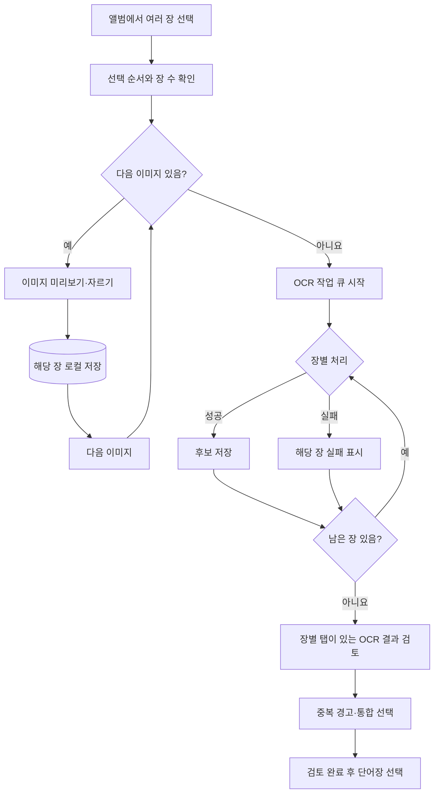
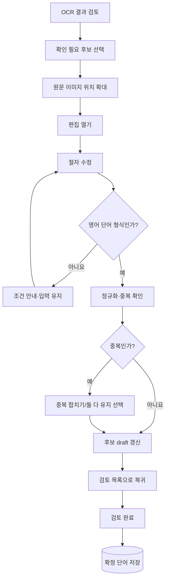
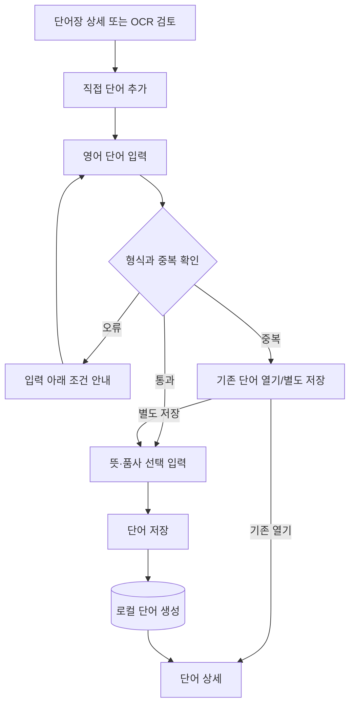
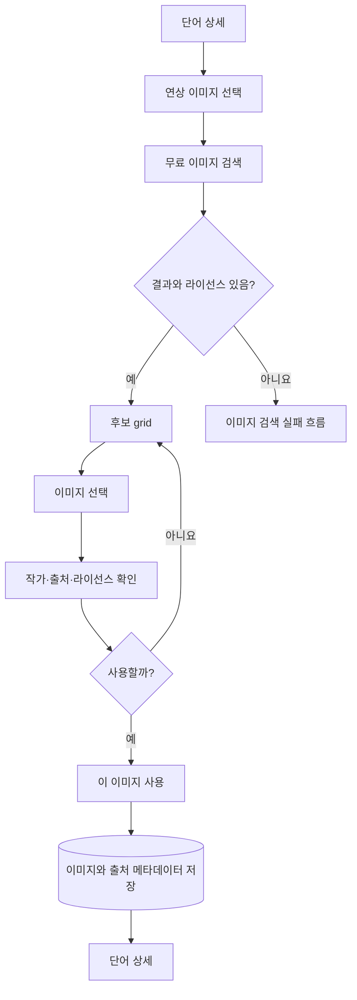
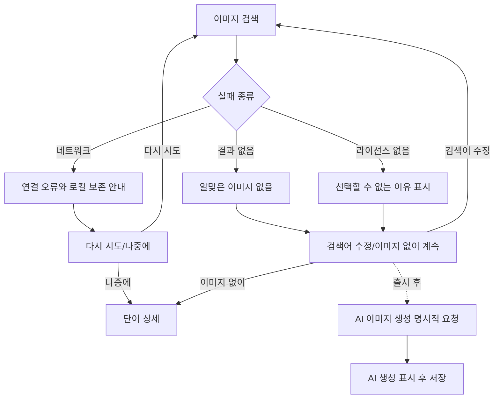
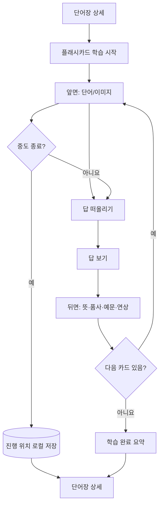
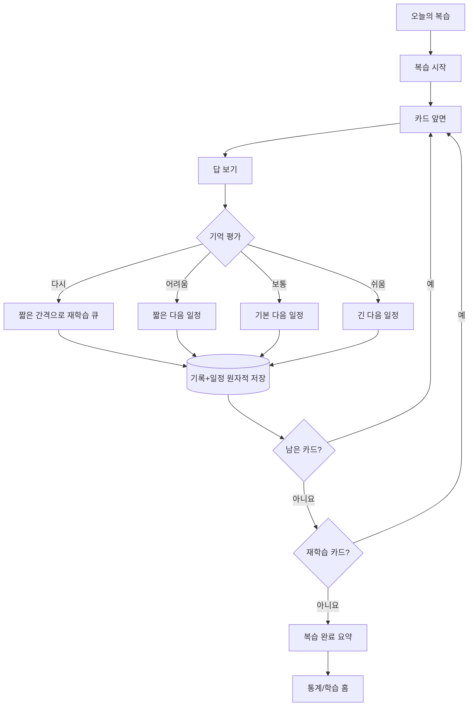
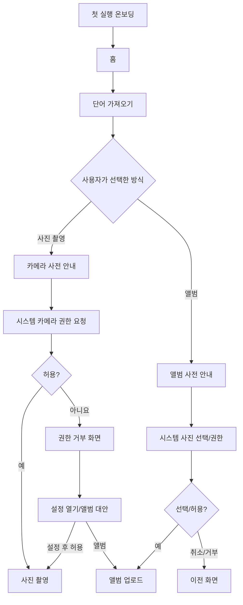
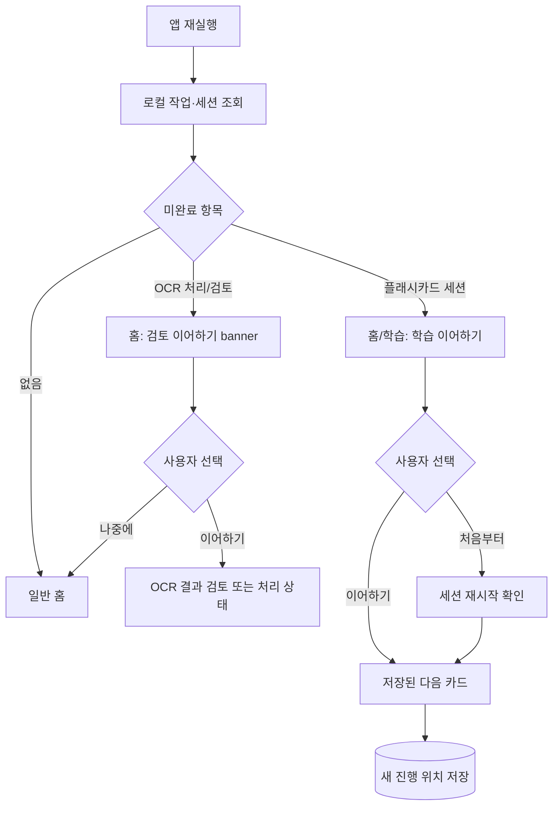

# 사용자 흐름

## 표기 원칙

- `[화면]`은 사용자가 보는 화면, `{판단}`은 분기, `[(로컬)]`은 로컬 저장을 뜻한다.
- OCR 후보는 `검토 완료` 전 단어 엔터티로 저장되지 않는다.
- 취소·외부 오류가 발생해도 가능한 한 작업 draft를 로컬에 남긴다.

## 1. 사진 한 장으로 단어장 생성

## 2. 여러 장 연속 업로드

여러 장 업로드는 MVP 후반 범위다. 각 장은 독립 작업 상태를 가지며 한 장 실패가 전체를 취소하지 않는다.

## 3. OCR 오인식 수정

## 4. 단어 수동 추가

## 5. 이미지 후보 선택

## 6. 이미지 검색 실패

## 7. 플래시카드 학습

## 8. 오답 단어 복습

## 9. 첫 실행 권한 요청

## 10. 앱 재실행 후 학습 이어하기

